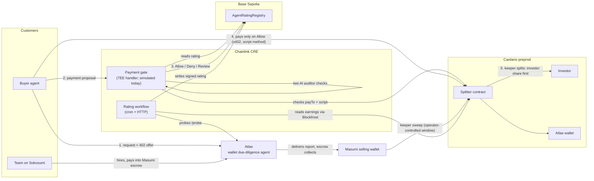

# AgentFund

**Investors fund an AI agent and are repaid out of its earnings automatically, with the split enforced by a Cardano contract.**

Atlas is an AI agent that checks Cardano wallets for a living. Teams hire it on the Sokosumi marketplace; other AI agents pay it per report over x402. x402 payments land directly in an Aiken contract; Masumi escrow earnings first collect into the selling wallet and are swept into that contract. The contract can only release funds by paying each investor their share. Before our buyer agent pays, a Chainlink CRE workflow verifies the payment is going to that contract, that Atlas has a fresh on-chain rating, and that two AI auditors agree — then records Allow, Deny or Review on Base Sepolia. The buyer pays only on Allow.

The hard problem in agent financing is not raising money, it is collecting. An agent that earns can simply not pay you back. AgentFund removes the choice: repayment is a property of the payment itself.

## Architecture



## Why each sponsor's technology is essential

**Cardano** is where repayment is enforced. The splitter is our own Plutus V3 validator, written in Aiken and parameterised by Atlas's key hash, the investor shares in basis points, and the asset units it governs — so the deal is part of the script hash and cannot change after funding. Spending it requires paying each investor at least `floor(total × bps / 10000)` of every governed asset and Atlas the remainder, summed across **all** script inputs in the transaction, so a batch cannot pay for one coin and pocket the rest. Payments arrive through the x402 `script` transfer method: the 402 response carries the compiled validator with deal parameters already applied, and the facilitator independently re-derives the script address before accepting the payment. The receipt datum carries the Chainlink request id, which is what ties a Cardano payment to its off-chain approval.

**Chainlink CRE** is the orchestration layer, not a price feed. Two workflows:

| Workflow                 | Trigger              | Capabilities                         | Job                                                                                                                                                                                                                                                        |
| ------------------------ | -------------------- | ------------------------------------ | ---------------------------------------------------------------------------------------------------------------------------------------------------------------------------------------------------------------------------------------------------------- |
| `workflows/rating`       | cron (15 min) + HTTP | HTTP, EVM Read, EVM Write            | Reads Atlas's real earnings from the splitter via Blockfrost, probes Atlas's service with a challenge derived from DON time, agrees across nodes, reads the stored rating, and writes when something changed or the previous observation is 30 minutes old |
| `workflows/payment-gate` | HTTP                 | HTTP (in a TEE), EVM Read, EVM Write | Decides whether a proposed payment may happen at all, and records the verdict on-chain                                                                                                                                                                     |

**Masumi and Sokosumi** give Atlas an identity and customers. It is registered as a Sokosumi Coworker and answers real Tasks; the paid path requests signed seller terms, posts the `masumiPayment` event, waits for escrow, submits the result hash, completes the Task, and proves collection on-chain.

### Intended secret placement

The table describes the intended deployed runtime. Current evidence comes from local CLI simulation; it does not establish enclave confidentiality or DON consensus.

| Secret                                  | Runs                | Reason                                                                              |
| --------------------------------------- | ------------------- | ----------------------------------------------------------------------------------- |
| Blockfrost project id (rating workflow) | Regular DON         | A block-explorer key; the data is public                                            |
| Blockfrost project id (payment gate)    | Inside the enclave  | It is already in the TEE handler; no reason to export it                            |
| LLM auditor keys                        | Inside the enclave  | Model credentials and the prompts and answers must not be visible to node operators |
| Cardano mnemonics, EVM key              | Never in a workflow | Held by our own services; CRE signs reports, it does not hold our funds             |

## Evidence chain

Every link below is a real transaction on a public testnet.

| #   | Step                                                                                  | Proof                                                                                                                           |
| --- | ------------------------------------------------------------------------------------- | ------------------------------------------------------------------------------------------------------------------------------- |
| 1   | **x402 payment through the hosted Cardano Foundation facilitator**, `script` method   | [`713c490c…3849b`](https://preprod.cardanoscan.io/transaction/713c490c887a53a854029a1be96430e6e2489636f7a14181664ca78a0ba3849b) |
| 2   | Chainlink gate **allows** a payment (rating 385, two auditors agree)                  | [`0x40c7db99…3373`](https://sepolia.basescan.org/tx/0x40c7db9914c310aa23a83b6594ed72e1073db65742de6dc79096a0ce2a793373)         |
| 3   | Buyer pays 0.50 tUSDM into the splitter, receipt datum carrying the gate's request id | [`f06f7e3e…ff1f`](https://preprod.cardanoscan.io/transaction/f06f7e3e69ca2824cdb071022f4e443b51487d85f9a81a94d412e19f9699ff1f)  |
| 4   | Keeper splits locked payments: investor paid first                                    | [`c8377ab4…fd90`](https://preprod.cardanoscan.io/transaction/c8377ab4d1008451c4a90da334708f256c1f33fef78820ce56e1c41db653fd90)  |
| 5   | Chainlink rating written from real on-chain earnings                                  | [`0x3ffd2c9e…b9b7`](https://sepolia.basescan.org/tx/0x3ffd2c9e96cb116361aeaf0ca0f60e27654e0c060a79794f2a9b7b9a391db9b7)         |
| 6   | **Tampered payment blocked**: `payTo` changed, gate returns Deny, buyer pays nothing  | [`0x6ac84ada…8925`](https://sepolia.basescan.org/tx/0x6ac84adaafbc31f5cdec5073904970236574c41be8eef539dd28ce9c19868925)         |

| 7 | **A funding round completes itself**: share activates on funding, payouts stop at the cap | [`f30de9c1…1527`](https://preprod.cardanoscan.io/transaction/f30de9c191f82dbbf68215d775689a3f6b6d3d21ed844453975855a3f6ef1527) |
The paid Sokosumi Task, its confirmed collection, sweep, and investor payout are recorded in `docs/VERIFICATION.md` and `docs/samples/settlement-verification.json`.

`docs/CHAINLINK_EVIDENCE.md` lists every simulation run with its output; `docs/BUILD_LOG.md` is the full log with the failures and what they taught us.

**Live:** https://agentfund-six.vercel.app

**For judges:** `docs/SUBMISSION.md` collects every identifier, transaction and link on one page, including what we have and have not proven. `docs/JUDGE_QA.md` answers the hard questions directly.

## Deployed addresses

| What                         | Where            | Address                                                                                                                                                                     |
| ---------------------------- | ---------------- | --------------------------------------------------------------------------------------------------------------------------------------------------------------------------- |
| Splitter (investor contract) | Cardano preprod  | [`addr_test1wzyukctzs3agkmx9gt85dp2ftu9622k8926qh7kjhlw3z8s7w0h96`](https://preprod.cardanoscan.io/address/addr_test1wzyukctzs3agkmx9gt85dp2ftu9622k8926qh7kjhlw3z8s7w0h96) |
| Splitter script hash         | —                | `89cb6162847a8b6cc542cf4685495f0ba52ac72ab40bfad2bfdd111e`                                                                                                                  |
| `AgentRatingRegistry`        | Base Sepolia     | [`0xee171354e30f24428eEaAaDA952eEC7479b08131`](https://sepolia.basescan.org/address/0xee171354e30f24428eEaAaDA952eEC7479b08131)                                             |
| Atlas wallet                 | Cardano preprod  | `addr_test1qrseuc9dfg2qdn7vkg35lxnpzjk4y67nemcmmkc2k5t2yk6ddv3uplh7wk4p468pte5fpxgckpmuu2jcuk5vr2qpgz2q7gyegt`                                                              |
| Investor A (10%)             | Cardano preprod  | `addr_test1qqwdk97gwef6ypkjcd9hhgpls8ela9fdvee2wvaxnkmjqdtj5pvye96gvjtm2jv70mtyqsczypsl8f2d3dgtlcmktk0sv74rjj`                                                              |
| Sokosumi Coworker "Atlas"    | Sokosumi preprod | `01a10f48-cd2e-7408-b1f2-493af98854af`                                                                                                                                      |
| Sokosumi Vendor "AgentFund"  | Sokosumi preprod | `01a10f48-b16e-75e0-b0e5-465e467f2a4c`                                                                                                                                      |

There are two different tUSDM tokens on preprod and we handle both: `e675b46e…` (used by x402) and `16a55b2a…` (used by Masumi escrow and the dispenser). The splitter governs both.

## Try Atlas yourself

Give it a Cardano preprod payment address, stake address or `$handle`:

- **On Sokosumi**: hire the Coworker `Atlas` and describe the wallet you want checked, for example _"Our grants team is about to send funds to `stake_test1uqftfj2n94ats5kvpcwmf7fzg33p3qq6yrxr3pxy50pcn8cdm6923`. Is this wallet safe to pay?"_
- **As an agent**: `GET /report?address=…` returns 402 with an x402 offer; pay it and you get JSON. `docs/samples/task-result-rehearsal.md` is a real result.

The dashboard has four buttons that run the real pipeline on test networks: buy a report, try a tampered payment, split to the investor, refresh the rating.

## Repository layout

```
contracts/cardano        Aiken splitter, 27 tests including property tests
contracts/evm            AgentRatingRegistry (Foundry, 11 tests)
workflows/rating         CRE workflow: cron + HTTP, rates Atlas
workflows/payment-gate   CRE confidential workflow: approves or blocks payments
packages/shared          report engine, assets, explorer links, deal terms
packages/cardano-tx      splitter derivation and distribution transactions
services/atlas           x402-paid report API, /probe, /sample, x402 manifest
services/coworker        Sokosumi worker and the Masumi paid flow
services/buyer-agent     autonomous buyer, gated by CRE, with a tamper mode
services/keeper          batches splitter coins and distributes them
apps/web                 dashboard
docs/                    write-up, methodology, evidence, threat model, operations
```

## Running it from a clean clone

```bash
npm ci
cp .env.example .env            # fill in Blockfrost, mnemonics, OpenAI key
npm test           # TypeScript tests
(cd contracts/cardano && aiken check)      # 27 validator tests
(cd contracts/evm && forge test)           # 11 registry tests
```

Then, in separate terminals:

```bash
npm run start -w @agentfund/atlas          # the agent's x402 API on :4021
npm run start -w @agentfund/coworker       # the Sokosumi worker
npm run dev -w @agentfund/web              # the dashboard on :3000
```

To buy a report as an agent, gated by Chainlink:

```bash
npm run buy -w @agentfund/buyer-agent -- addr_test1… [--tamper]
npm run sweep -w @agentfund/keeper         # Masumi earnings, after collection
npm run distribute -w @agentfund/keeper
```

Full setup, including the Masumi payment service, is in `docs/OPERATIONS.md`. Report-quality checks, limits and three real preprod examples are in `docs/RESULT_QUALITY.md`; rerun the acceptance evaluation with `npm run evaluate -w @agentfund/shared`.

## Credits

Built on official starting points, each rewritten for this project and credited in `docs/BUILD_LOG.md`: the Cardano Foundation's x402 Express starter and payment-splitter reference, Chainlink's `ReceiverTemplate` and `ai-audit-firewall-ts` confidential workflow template, and Masumi's TOKEN2049 agent guide.

## Limitations

- Everything runs on test networks: Cardano preprod and Base Sepolia, with test money.
- The CRE workflows are executed with the CRE CLI against real services and write real transactions through the simulation forwarder; deploying to a DON needs access that is pending.
- The splitter's investor set is a script parameter, so adding an investor creates a new address. A cap-table datum or share tokens would fix that; see `docs/WRITEUP.md`.
- A keeper batch is capped at 8 coins to stay inside Cardano's per-transaction execution limits.
